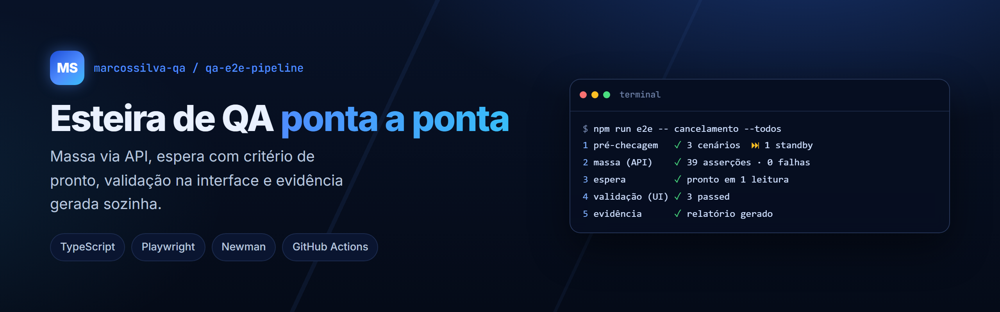
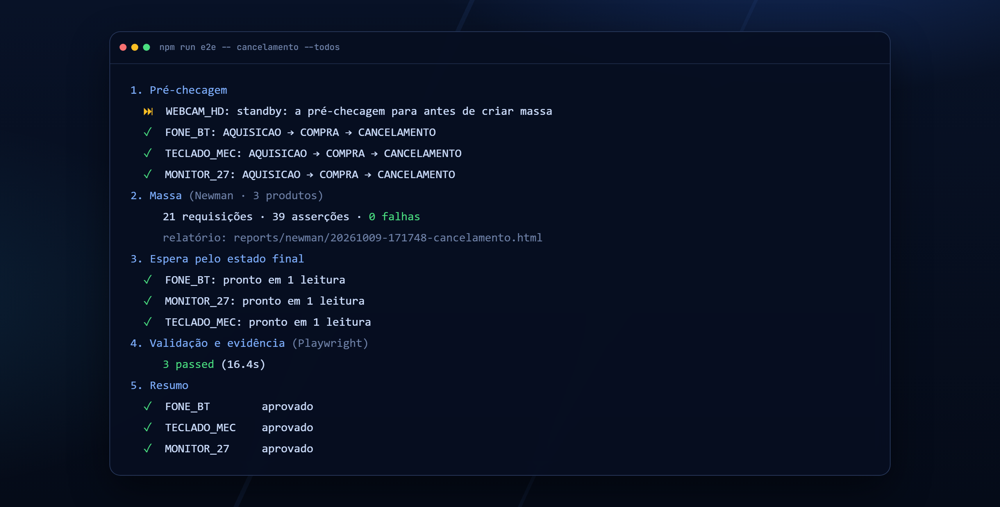
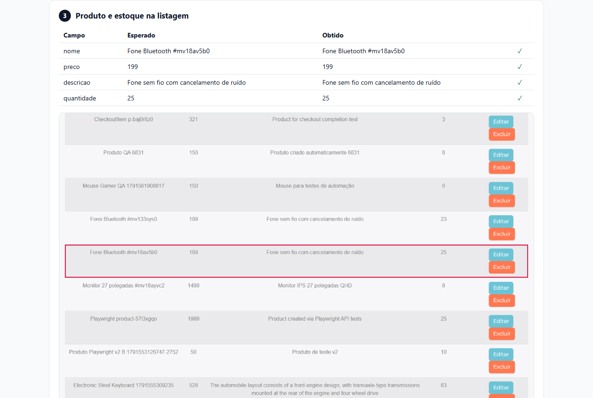
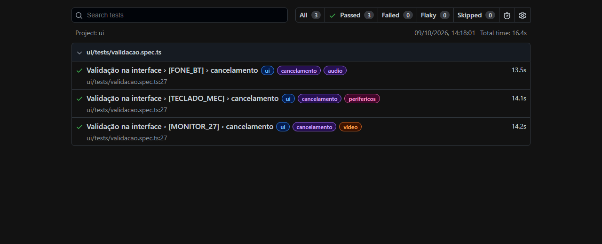
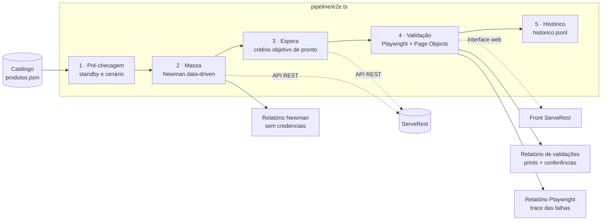

<p align="center">
  
</p>

<p align="center">
  <a href="https://github.com/marcossilva-qa/qa-e2e-pipeline/actions/workflows/esteira.yml"></a>
  <a href="https://marcossilva-qa.github.io/qa-e2e-pipeline/"></a>
  
  
  
</p>

<p align="center">
  <a href="https://marcossilva-qa.github.io/qa-e2e-pipeline/"><b>Relatórios da última execução</b></a> ·
  <a href="https://marcossilva-qa.github.io/case/esteira-qa.html"><b>Case completo</b></a> ·
  <a href="https://marcossilva-qa.github.io"><b>Portfólio</b></a>
</p>

Um comando cria a massa de teste pela API, espera o sistema chegar ao estado final, valida
campo a campo na interface e entrega a evidência pronta, com print de cada tela.

```bash
npm run e2e -- cancelamento --todos
```

> **De onde vem este projeto.** É a versão pública de uma esteira que construí num projeto real
> de telecom e streaming: lá ela cria assinaturas pelas APIs, acompanha a orquestração dos
> pedidos no Salesforce e gera a evidência de mais de 2 mil cenários. O código original é do
> cliente e não pode ser publicado, então reproduzi **a mesma arquitetura e as mesmas técnicas**
> contra o [ServeRest](https://serverest.dev), uma loja pública feita para estudo de testes.
> O case completo, com resultados, está no [meu portfólio](https://marcossilva-qa.github.io).

## Em ação

<p align="center">
  
</p>

| Evidência por cenário                                                                                                                    | Relatório do Playwright                                                                          |
| ---------------------------------------------------------------------------------------------------------------------------------------- | ------------------------------------------------------------------------------------------------ |
|  |  |
| Cada tela conferida campo a campo (esperado × obtido), com a linha da massa destacada no print e a senha mascarada.                      | Um teste por massa criada, com tags de fluxo e categoria e trace das falhas.                     |

## Arquitetura



| Camada       | Pasta                   | O que faz                                                                                                         |
| ------------ | ----------------------- | ----------------------------------------------------------------------------------------------------------------- |
| Massa        | [`api/`](api)           | Collection Postman v2.1 com uma pasta por etapa do ciclo de vida; o Newman a roda uma vez por produto do catálogo |
| Validação    | [`ui/`](ui)             | Playwright + TypeScript: login com a massa, conferência de cada tela, evidência e logout garantido                |
| Orquestração | [`pipeline/`](pipeline) | Pré-checagem, espera entre as camadas, validação só do que está pronto, histórico e resumo                        |
| Regras       | [`shared/`](shared)     | Regras de negócio como funções puras, testadas sem navegador nem rede                                             |

## Fluxos

Cada fluxo é uma sequência de pastas da collection ([`shared/catalogo.ts`](shared/catalogo.ts)),
como os pedidos de um ciclo de vida: o cancelamento passa pela compra, assim como numa
assinatura a retomada passa pela suspensão. Nenhuma requisição é duplicada entre fluxos.

| Fluxo          | Sequência                         | Estado final validado na interface           |
| -------------- | --------------------------------- | -------------------------------------------- |
| `aquisicao`    | AQUISICAO                         | usuário e produto cadastrados, estoque cheio |
| `compra`       | AQUISICAO → COMPRA                | estoque baixado, carrinho aberto             |
| `cancelamento` | AQUISICAO → COMPRA → CANCELAMENTO | estoque reabastecido, sem carrinho           |
| `conclusao`    | AQUISICAO → COMPRA → CONCLUSAO    | estoque baixado, sem carrinho                |

## O que este projeto demonstra

- **Testes orientados a dados.** Produto novo é uma linha em [`api/catalogo/produtos.json`](api/catalogo/produtos.json), não código novo. O catálogo é validado por teste unitário.
- **Pré-checagem antes de gastar massa.** Cenário inexistente ou em `standby` é recusado antes de qualquer chamada de API (o `WEBCAM_HD` do catálogo mostra isso).
- **Espera com critério objetivo.** Nada de `sleep` fixo: o estado é lido pela API e classificado como `pronto`, `andamento` ou `falhou` por uma regra pura ([`classificarProcessamento`](shared/regras.ts)), coberta por testes.
- **Divergência não interrompe a coleta.** O teste percorre todas as telas, gera toda a evidência e só reprova no último passo, listando todos os campos divergentes de uma vez.
- **Credenciais fora da evidência.** O que esconder no relatório do Newman é calculado da própria collection ([`api/ocultacao.ts`](api/ocultacao.ts)), e o HTML gerado é varrido depois do run. Na interface, a coluna de senha é mascarada no print.
- **Page Objects e leitura por cabeçalho.** Colunas são lidas pelo nome do cabeçalho, não pela posição. A linha da massa é achada por um valor único, numa tabela com centenas de registros de outras pessoas.
- **Verificação estática da collection.** Toda requisição precisa conferir o status HTTP, toda URL passa por `{{baseUrl}}` e nenhum corpo pode ter credencial fixa ([`tests-unit/colecao.test.ts`](tests-unit/colecao.test.ts)).
- **Sessão sempre encerrada.** O logout é feito mesmo com o teste falhando, e confirmado pela volta à tela de login.
- **CI completo.** Qualidade (typecheck, ESLint, Prettier, testes unitários), E2E em matriz por fluxo, execução agendada em dias úteis e relatórios publicados no GitHub Pages.

## Como rodar

Pré-requisito: Node.js 24.

```bash
npm ci
```

```bash
npx playwright install chromium
```

Esteira completa para um fluxo e todos os produtos:

```bash
npm run e2e -- compra --todos
```

Só alguns produtos, ou só o plano, sem criar massa:

```bash
npm run e2e -- cancelamento FONE_BT TECLADO_MEC
```

```bash
npm run e2e:dry -- conclusao --todos
```

Camadas isoladas:

```bash
npm run massa -- compra --todos
```

```bash
npm run test:ui
```

Qualidade (o mesmo que o CI roda primeiro):

```bash
npm run check
```

Para ver o navegador durante a validação, defina `HEADED=1`. Os endereços da API e do front
podem ser trocados por `API_URL` e `FRONT_URL`, por exemplo para um ServeRest local.

## Onde ficam os resultados

| O quê                                              | Onde                                                              |
| -------------------------------------------------- | ----------------------------------------------------------------- |
| Relatório da massa (Newman htmlextra)              | `reports/newman/<execução>.html`                                  |
| Relatório de validações, com prints e conferências | `evidencias/<execução>/<fluxo>-<produto>.html`                    |
| Relatório do Playwright, com trace das falhas      | `npm run report`                                                  |
| Histórico de execuções                             | `execucoes/historico.jsonl`                                       |
| Tudo isso, da última execução no CI                | [GitHub Pages](https://marcossilva-qa.github.io/qa-e2e-pipeline/) |

## Estrutura

```
api/
  catalogo/produtos.json        massa de dados: um produto por linha
  colecao/                      collection Postman v2.1 (importável no Postman)
  ocultacao.ts                  o que esconder no relatório, calculado da collection
  run.ts                        executa o Newman e devolve a massa de cada produto
docs/imagens/                   banner e prints usados neste README
pipeline/
  e2e.ts                        orquestrador: pré-checagem → massa → espera → validação → histórico
  aguardar.ts                   espera pelo estado final, lido pela API
  indice-pages.ts               página inicial dos relatórios no GitHub Pages
shared/
  catalogo.ts                   fluxos, validação do catálogo e pré-checagem
  regras.ts                     regras de negócio puras
ui/
  pages/                        Page Objects
  fixtures/                     sessão (login e logout garantido) e leitura da massa
  evidencia/                    captura das telas e relatório de validações
  tests/validacao.spec.ts       um teste por massa criada
tests-unit/                     regras, catálogo, collection e ocultação de credenciais
```

## Decisões técnicas

- **Por que Newman, e não chamadas `fetch` direto no TypeScript?** A collection é um artefato que o time de QA já usa e entende no Postman. Ela continua importável e executável lá, e o Newman a transforma em etapa automatizada sem reescrita.
- **Por que a validação não cria dados?** Separar quem cria de quem valida permite validar de novo uma massa existente, sem recriá-la, e mantém cada camada testável sozinha.
- **Por que regras como funções puras?** As regras de negócio rodam em milissegundos, sem navegador, e falham com mensagem clara. O teste de interface fica só com o que exige interface.
- **Ambiente público e compartilhado.** O ServeRest é usado por muita gente ao mesmo tempo. Por isso toda massa tem nome único, as linhas são achadas por valor único e cada cenário usa o próprio usuário, o que permite paralelismo sem disputa de sessão.

## Licença

[MIT](LICENSE)
